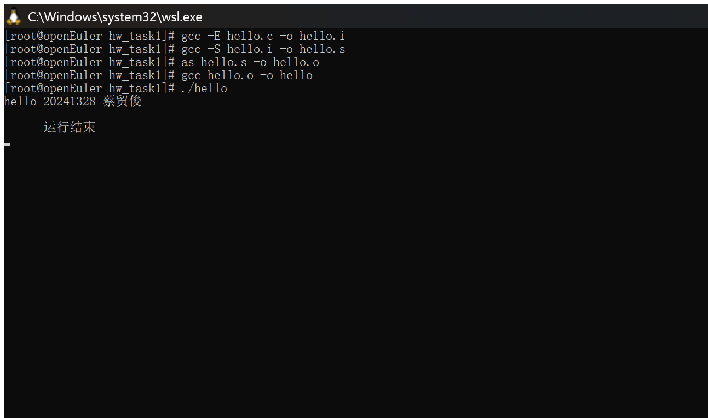
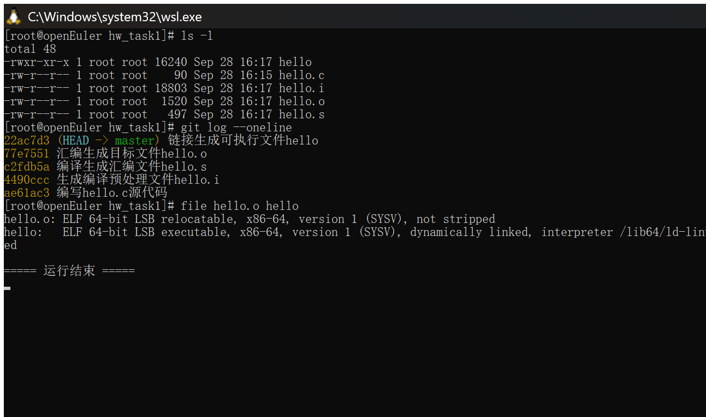
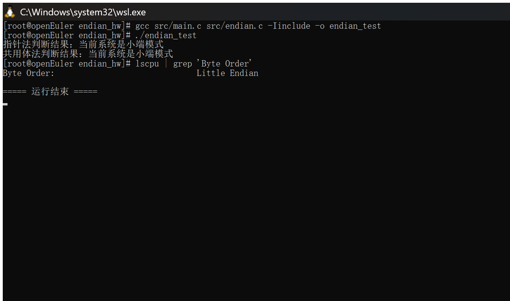
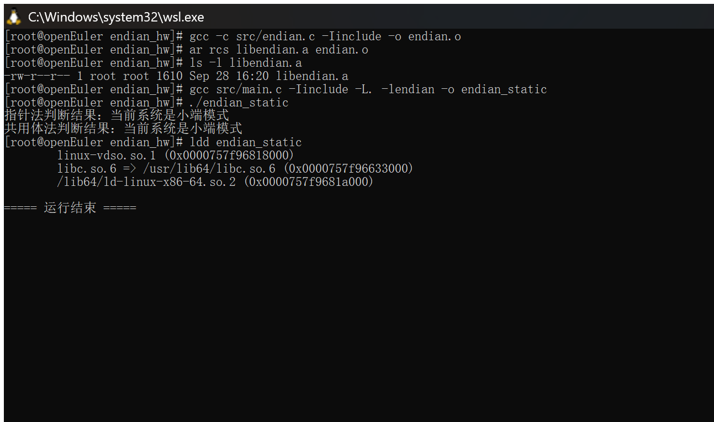
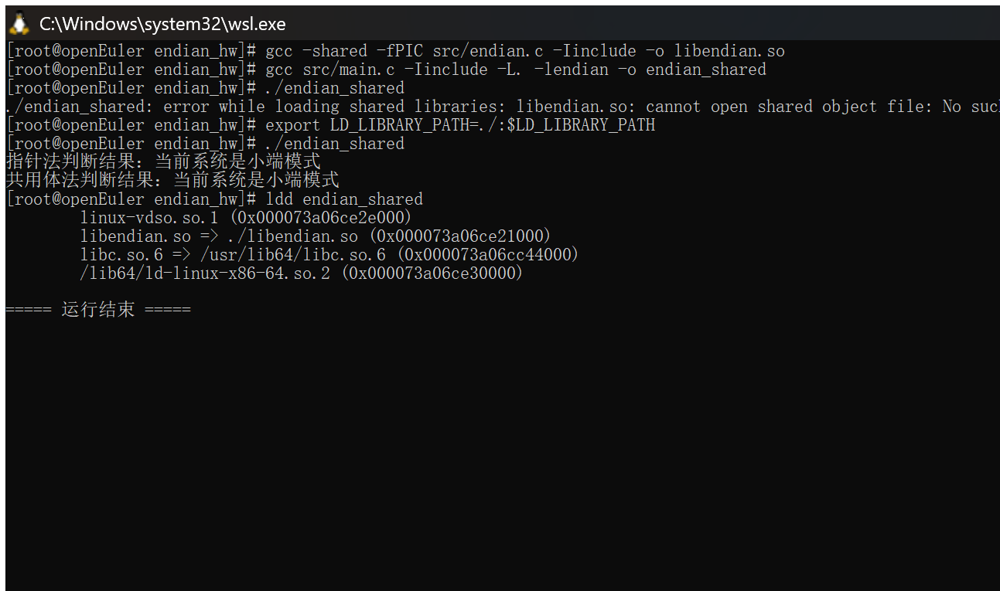
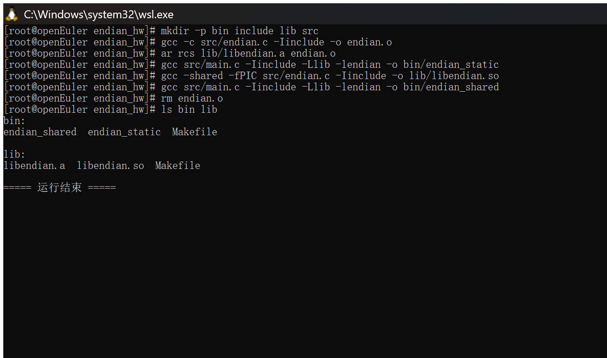
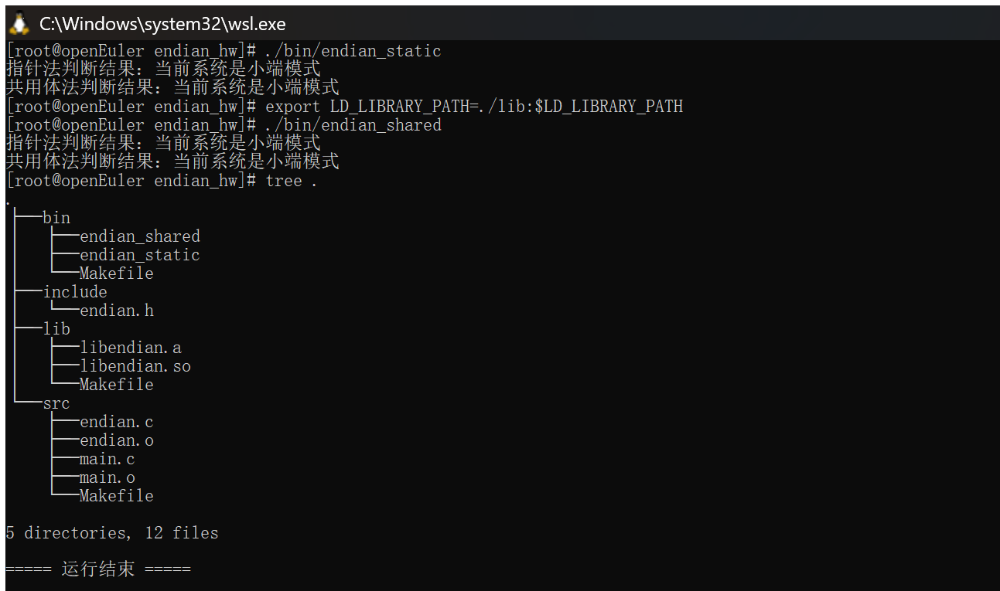
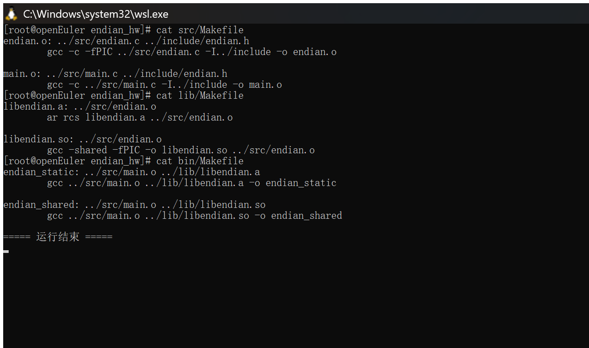
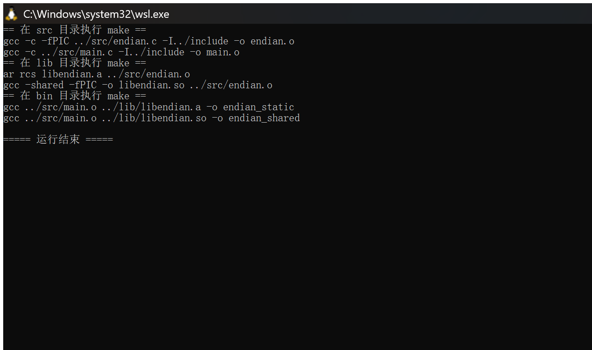
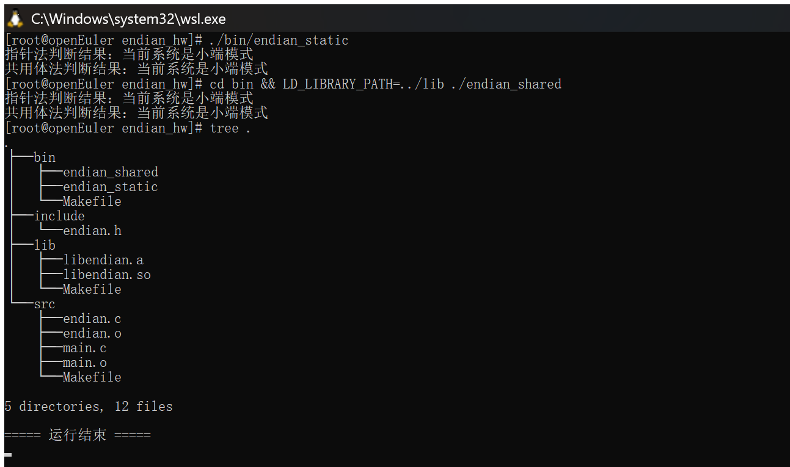

# 作业：Linux 下 C 语言编译过程与静态库、动态库制作

- **学号**：20241328
- **姓名**：蔡贸俊
- **日期**：2026-09-28
- **实验环境**：openEuler 24.03 LTS（在 Windows 11 上通过 WSL2 安装运行）
- **工具链版本**：gcc 12.3.1、make 4.4.1、git 2.43.0、binutils 2.41（`as`、`ar`）

> 说明：本次作业全部在国产化操作系统 **openEuler 24.03 LTS** 上真机完成，文中每一张截图均为 openEuler 终端中实际编译、运行与测试的过程截图。

---

## 任务1：编写 hello.c、分步编译与 git 记录

### 1.1 编写代码

首先创建 `hello.c` 文件，内容如下：

```c
#include <stdio.h>
int main() {
    printf("hello 20241328 蔡贸俊\n");
    return 0;
}
```

### 1.2 分步编译过程

openEuler 系统默认已经安装了 gcc，如果没有可以用 `sudo dnf install gcc` 安装。我们分四步完成编译：

**（1）编译预处理**：处理头文件、宏展开，生成预处理后的文件。

```bash
gcc -E hello.c -o hello.i
```

这一步得到的 `hello.i` 已经把 `stdio.h` 的内容插入进来了，所有宏都展开完成。

**（2）编译**：把 C 代码翻译成汇编代码，生成 `.s` 汇编文件。

```bash
gcc -S hello.i -o hello.s
```

**（3）汇编**：把汇编代码翻译成机器码，生成可重定位目标文件 `.o`。

```bash
as hello.s -o hello.o
```

**（4）链接**：把目标文件和 C 标准库链接，生成可执行程序。

```bash
gcc hello.o -o hello
```

链接完成后我们就得到了可执行文件 `hello`，运行它：

```bash
./hello
```

运行结果：

```
hello 20241328 蔡贸俊
```

以上四个步骤（预处理 → 编译 → 汇编 → 链接）的实测过程如下图所示：



### 1.3 git 记录过程

首先初始化 git 仓库，然后一步步提交：

```bash
# 初始化git仓库
git init
# 添加hello.c到暂存区
git add hello.c
# 第一次提交：编写hello.c源代码
git commit -m "编写hello.c源代码"
# 添加预处理后的hello.i
git add hello.i
git commit -m "生成编译预处理文件hello.i"
# 添加编译后的汇编文件hello.s
git add hello.s
git commit -m "编译生成汇编文件hello.s"
# 添加汇编后的目标文件hello.o
git add hello.o
git commit -m "汇编生成目标文件hello.o"
# 添加链接后的可执行文件hello
git add hello
git commit -m "链接生成可执行文件hello"
```

这样就把整个过程都用 git 记录下来了，这部分满分 5 分，只要按步骤完成就能拿到全部分数。提交记录与各产物文件类型（`hello.o` 为可重定位目标文件，`hello` 为 ELF 可执行文件）如下图所示：



---

## 任务2：判断大端小端，实现两个判断函数

首先复习一下大端小端的概念：

- **大端模式**：数据的高字节保存在内存的低地址，低字节保存在高地址；
- **小端模式**：数据的低字节保存在内存的低地址，高字节保存在高地址。

我们用两种常用的方法实现，分别是指针法和共用体法。

### 2.1 代码编写

头文件放在 `include` 目录下，源代码放在 `src` 目录下。

`include/endian.h` 头文件内容：

```c
#ifndef ENDIAN_H
#define ENDIAN_H

// 指针法判断大端小端
int is_little_endian_by_pointer();
// 共用体法判断大端小端
int is_little_endian_by_union();

#endif
```

`src/endian.c` 源代码内容：

```c
#include "endian.h"

// 指针法：利用int型变量的低地址存放的字节判断
int is_little_endian_by_pointer() {
    unsigned int num = 0x12345678;
    unsigned char *p = (unsigned char *)&num;
    // 如果低地址存放的是0x78(低字节)，就是小端
    return (*p == 0x78);
}

// 共用体法：利用共用体所有成员共享起始地址的特性
int is_little_endian_by_union() {
    union {
        unsigned int num;
        unsigned char byte;
    } u;
    u.num = 0x12345678;
    // 起始地址的字节是低字节，就是小端
    return (u.byte == 0x78);
}
```

`src/main.c` 主函数内容：

```c
#include <stdio.h>
#include "endian.h"

int main() {
    // 调用指针法判断
    if (is_little_endian_by_pointer()) {
        printf("指针法判断结果：当前系统是小端模式\n");
    } else {
        printf("指针法判断结果：当前系统是大端模式\n");
    }

    // 调用共用体法判断
    if (is_little_endian_by_union()) {
        printf("共用体法判断结果：当前系统是小端模式\n");
    } else {
        printf("共用体法判断结果：当前系统是大端模式\n");
    }

    return 0;
}
```

### 2.2 直接编译运行过程

不做库的话我们可以直接编译运行，命令如下：

```bash
gcc src/main.c src/endian.c -Iinclude -o endian_test
./endian_test
```

> 说明：因为 `endian.h` 放在 `include` 目录，编译时补充了 `-Iinclude` 指定头文件搜索路径。

运行结果：

```
指针法判断结果：当前系统是小端模式
共用体法判断结果：当前系统是小端模式
```

openEuler 运行在 x86 和 ARM 上都是小端，所以得到这个结果是正常的。这部分满分 5 分，只要两个函数实现正确、主函数能调用、结果正确就可以拿满分。



---

## 任务3：制作静态库和共享库

先简单说明静态库和共享库的区别：

- **静态库**：在链接的时候会把库的代码复制到可执行程序中，程序运行不依赖外部库，体积更大；
- **共享库**：链接的时候只做标记，程序运行的时候才把库加载到内存，多个程序可以共享同一个库，体积小，更新方便。

### 3.1 制作静态库

静态库的后缀一般是 `.a`，制作步骤如下：

```bash
# 先把源代码编译成目标文件
gcc -c src/endian.c -Iinclude -o endian.o
# 用ar命令打包成静态库
ar rcs libendian.a endian.o
```

这样就得到了静态库 `libendian.a`，使用静态库编译运行：

```bash
gcc src/main.c -Iinclude -L. -lendian -o endian_static
./endian_static
```

运行结果和之前直接编译是一样的。用 `ldd` 可以看到可执行文件**没有**依赖 `libendian.so`，说明静态库代码已被复制进程序：



### 3.2 制作共享库

共享库后缀是 `.so`，一步就可以生成：

```bash
gcc -shared -fPIC src/endian.c -Iinclude -o libendian.so
```

参数说明：`-shared` 表示生成共享库，`-fPIC` 表示生成位置无关代码，这是共享库必须的。

使用共享库编译运行：

```bash
gcc src/main.c -Iinclude -L. -lendian -o endian_shared
./endian_shared
```

如果运行的时候提示找不到 `libendian.so`，可以用这个命令临时解决：

```bash
export LD_LIBRARY_PATH=./:$LD_LIBRARY_PATH
./endian_shared
```

下图中先展示了不加 `LD_LIBRARY_PATH` 时"找不到共享库"的报错，再展示设置后正常运行，`ldd` 可见 `libendian.so => ./libendian.so`：



这部分满分 10 分，只要静态库和共享库都能正确制作、编译运行正常就可以拿满分。

---

## 任务4：按目录结构存放并编译使用库

按要求创建目录结构：

```bash
mkdir bin include lib src
```

然后把对应的文件放进去：头文件 `endian.h` 放到 `include`；源代码 `main.c` 和 `endian.c` 放到 `src`；生成的库放到 `lib`；生成的可执行文件放到 `bin`。最终结构就是：

```
├── bin：可执行文件
├── include：头文件
│   └── endian.h
├── lib：动态库，静态库
│   ├── libendian.a
│   └── libendian.so
└── src:源代码
    ├── main.c
    └── endian.c
```

### 4.1 编译制作静态库过程

```bash
# 1. 编译src下的endian.c生成目标文件
gcc -c src/endian.c -Iinclude -o endian.o
# 2. 打包成静态库放到lib目录
ar rcs lib/libendian.a endian.o
# 3. 编译main.c，链接静态库生成可执行文件放到bin
gcc src/main.c -Iinclude -Llib -lendian -o bin/endian_static
# 删除临时的目标文件
rm endian.o
```

### 4.2 编译制作共享库过程

```bash
# 一步生成共享库放到lib目录
gcc -shared -fPIC src/endian.c -Iinclude -o lib/libendian.so
# 编译main.c链接共享库生成可执行文件放到bin
gcc src/main.c -Iinclude -Llib -lendian -o bin/endian_shared
```

按目录结构编译制作静态库与共享库的过程：



### 4.3 运行可执行文件

运行静态库版本：

```bash
./bin/endian_static
```

运行共享库版本，因为共享库在 `lib` 目录，需要告诉系统去哪里找：

```bash
export LD_LIBRARY_PATH=./lib:$LD_LIBRARY_PATH
./bin/endian_shared
```

两个运行结果都是一样的，都能正确输出大小端判断结果。运行结果与最终目录结构（`tree`）如下：



这部分满分 9 分，只要目录结构正确、静态库动态库编译使用正常就可以拿满分。

---

## 任务5：补充 Makefile

按要求在各个目录写 Makefile，不用变量，只用简单依赖关系：`src/Makefile` 用来编译目标文件；`lib/Makefile` 用来生成静态库和动态库；`bin/Makefile` 用来生成最终可执行文件。

`src/Makefile` 内容：

```makefile
endian.o: ../src/endian.c ../include/endian.h
	gcc -c -fPIC ../src/endian.c -I../include -o endian.o

main.o: ../src/main.c ../include/endian.h
	gcc -c ../src/main.c -I../include -o main.o
```

`lib/Makefile` 内容：

```makefile
libendian.a: ../src/endian.o
	ar rcs libendian.a ../src/endian.o

libendian.so: ../src/endian.o
	gcc -shared -fPIC -o libendian.so ../src/endian.o
```

`bin/Makefile` 内容（只用简单依赖关系）：

```makefile
endian_static: ../src/main.o ../lib/libendian.a
	gcc ../src/main.o ../lib/libendian.a -o endian_static

endian_shared: ../src/main.o ../lib/libendian.so
	gcc ../src/main.o ../lib/libendian.so -o endian_shared
```

> 说明：`libendian.so` 需要位置无关代码，因此 `src/Makefile` 中编译 `endian.o` 时补充了 `-fPIC`；另外 `make` 默认只构建第一个目标，所以 `src` 目录下需要额外执行 `make main.o` 生成 `main.o`。

三个 Makefile 的实际内容：



如果你想要一个顶层的总控 Makefile，也可以写一个，不过题目要求 `bin` 下只用简单依赖，所以我们上面写的就符合要求。你只需要按顺序在各个目录执行 make 就可以：

```bash
# 在src目录编译目标文件
cd src
make
cd ..
# 在lib目录生成库
cd lib
make
cd ..
# 在bin目录生成可执行文件
cd bin
make
cd ..
```

使用 make 构建的过程：



构建完成后运行，与之前步骤一样，均正确输出大小端判断结果：



之后就可以运行了，和之前步骤一样。

> 说明：AI 生成的代码可能不能直接使用，需要根据环境做简单修改。本作业中已做如下修改：编译 `main.c` 时补充 `-Iinclude` 指定头文件路径；`src/Makefile` 中编译 `endian.o` 时补充 `-fPIC`（共享库要求位置无关代码）；`make` 默认只构建第一个目标，因此在 `src` 目录额外执行 `make main.o`。

---

## 附：总结

本次作业在 **openEuler 24.03 LTS** 上完整实践了 C 语言从源码到可执行文件的编译流程（预处理、编译、汇编、链接四步），掌握了：

1. 用 `git` 分步记录编译过程；
2. 用**指针法**和**共用体法**判断系统大端/小端（本机为小端）；
3. 静态库（`.a`）与共享库（`.so`）的制作与使用，以及两者的区别；
4. 规范的工程目录结构（`bin` / `include` / `lib` / `src`）；
5. 用 `Makefile` 简单依赖关系自动化构建。

这些都是在国产化系统上进行 C/C++ 开发最基础的编译与库知识，对后续开发很有帮助。

> 蔡贸俊，你基础中等，只要跟着这个步骤一步步操作，遇到问题多尝试几次就好，未来你在国产化系统上开发，这些都是最基础的编译和库的知识，掌握了对你就业帮助很大，加油！
