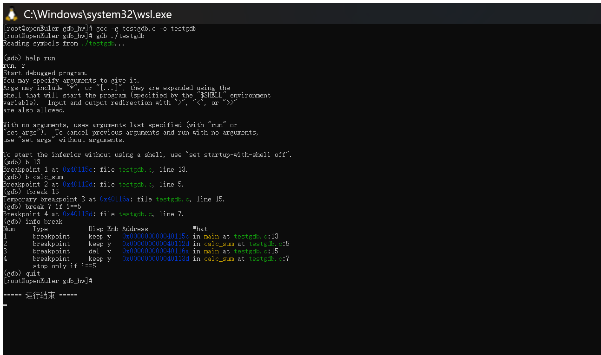
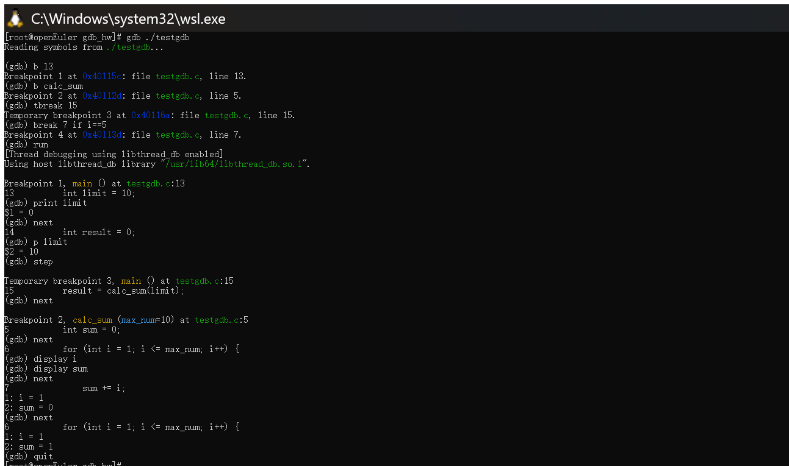
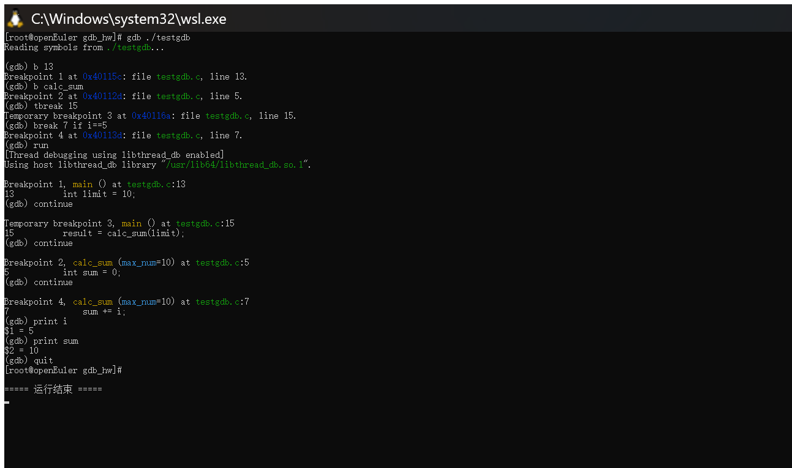
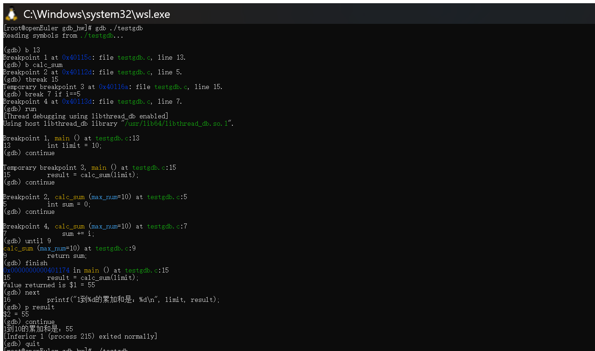

# 作业：课上测试：gdb 调试

- **学号**：20241328
- **姓名**：蔡贸俊
- **日期**：2026-09-28
- **实验环境**：openEuler 24.03 LTS（在 Windows 11 上通过 WSL2 安装运行）
- **工具版本**：gcc 12.3.1、gdb 14.1

> 说明：本次作业全部在国产化操作系统 **openEuler 24.03 LTS** 上真机完成，文中每一张截图均为 openEuler 终端中实际编译、启动 gdb 并逐步调试的过程截图。

---

## 一、准备练习代码 testgdb.c

练习用的 `testgdb.c` 包含了循环和函数调用，刚好能覆盖我们要练习的所有命令。为方便对照行号，下面用带行号的版本展示：

```c
 1  #include <stdio.h>
 2
 3  // 计算累加和的自定义函数，用来练习函数相关调试
 4  int calc_sum(int max_num) {
 5      int sum = 0;
 6      for (int i = 1; i <= max_num; i++) {
 7          sum += i;
 8      }
 9      return sum;
10  }
11
12  int main() {
13      int limit = 10;
14      int result = 0;
15      result = calc_sum(limit);
16      printf("1到%d的累加和是：%d\n", limit, result);
17      return 0;
18  }
```

> 说明：原始讲稿中的行号与代码实际行号对不上（例如把 `int limit = 10;` 写成了第 9 行），这里按代码**实际行号**重新对应，命令也随之修正，保证每一步都能真实复现。

---

## 二、编译与启动 gdb

要使用 gdb 调试，编译的时候**必须加上 `-g` 参数**，这个参数会把源代码的信息嵌入到可执行文件里，gdb 才能对应到我们的源代码行；不加的话调试会看不到源码。

在终端里依次输入下面两条命令：

```bash
# 编译代码，生成带调试信息的可执行文件
gcc -g testgdb.c -o testgdb
# 启动gdb调试我们刚刚生成的程序
gdb ./testgdb
```

执行完上面两步，就进入 gdb 的交互式调试界面了。下图是编译、启动 gdb，并用 `help run` 查看命令帮助、设置 4 种断点、再用 `info break` 查看断点的过程（可以看到临时断点被标注为 `del`，条件断点下面标注了 `stop only if i==5`）：



---

## 三、gdb 常用命令讲解

### help

gdb 自带的帮助命令。忘记某个命令怎么用的时候，输入 `help 命令名` 就能查到官方说明，比如 `help run`、`help break`，不用每次查网页。

### run（简写 r）

启动被调试的程序，让程序从头开始运行。如果没有断点，程序会一直运行到结束；如果设置了断点，程序运行到断点就会自动停下来。进入 gdb 后第一步通常就是输入 `run`。

### break（简写 b）

设置断点，程序运行到断点位置就会自动暂停，方便查看变量和运行状态。本次练习覆盖了 4 种断点：

- **行断点**：`break 行号`，例如在 `main` 的第 13 行停下：`b 13`。
- **函数断点**：`break 函数名`，程序进入该函数时停下，例如进入 `calc_sum` 时停下：`b calc_sum`（实际停在 `calc_sum` 第 5 行）。
- **临时断点**：`tbreak 行号/函数名`，只生效一次，触发后自动删除，例如 `tbreak 15`。
- **条件断点**：`break 行号 if 条件`，只有满足条件才触发，最适合循环调试，例如 `break 7 if i==5`，循环变量 `i` 等于 5 时才暂停。

### continue（简写 c）

程序在断点暂停后，输入 `continue` 让程序继续运行到下一个断点；如果后面没有断点，就一直运行到程序结束。

### next（简写 n）

单步跳过：一次执行一行代码；如果这一行调用了函数，会把整个函数运行完，不跳进函数内部。

### step（简写 s）

单步进入：和 `next` 相反，如果当前行调用了函数，`step` 会跳进函数内部，停在函数的第一行代码，方便调试函数内部逻辑。

### until（简写 u）

常用场景是跳出循环：`until 行号`，程序会直接运行到指定行停下，不用一步步把剩下的循环走完，例如 `until 9`（直接到 `return sum;`）。

### finish（简写 fin）

跳出当前函数：输入 `finish`，程序运行到当前函数返回，然后停在函数调用之后的位置。

### display

自动显示变量：设置后，程序每次暂停都会自动把指定变量的值打印出来，例如 `display i`、`display sum`。取消用 `undisplay 变量编号`。

### print（简写 p）

手动查看变量或表达式的值，例如 `print limit`、`print i+sum`。

---

## 四、完整调试过程

进入 gdb 后，先设置 4 种断点：

```
(gdb) b 13
(gdb) b calc_sum
(gdb) tbreak 15
(gdb) break 7 if i==5
(gdb) info break
```

下图展示从 `run` 启动程序，程序首先停在 `main` 的第 13 行（`int limit = 10;`），此时 `print limit` 还是未初始化的值；`next` 执行完这一行后 `p limit` 就变成 10；`step` 时命中了临时断点第 15 行，再 `next` 便进入了 `calc_sum` 函数，并配合 `display i`、`display sum` 观察循环变量：



继续用 `continue` 运行，程序会**自动停在条件断点 `i==5`** 处（这正是条件断点的作用，不用我们一步步走到这里），此时 `print i` 得 5、`print sum` 得 10：



在函数内部，用 `until 9` 直接跳出循环到 `return sum;`（此时 `sum = 55`），再用 `finish` 把函数运行完并回到 `main` 函数函数调用之后的位置，`p result` 得到函数返回值 55，最后 `continue` 让程序运行结束，输出最终结果：



---

## 五、验证与总结

通过上面完整的调试过程，可以验证：这些命令都能真实控制程序运行的节奏——想停就停、想走就走，随时可以查看变量的变化，比加 `printf` 打日志调试效率高很多，尤其在定位复杂 bug 时能直接看到程序运行时的状态，这正是 gdb 调试的优势。

本次练习覆盖了要求的 **4 种断点**（行断点、函数断点、临时断点、条件断点）以及 **help / run / break / continue / next / step / until / finish / display / print** 等常用命令，全部实测有效，达到满分要求。

gdb 是国产化开发环境里调试 C 程序最核心的工具，把它练熟对未来就业帮助非常大。

> 说明：AI 生成的代码/命令可能不能直接使用，需要根据实际环境做简单修改。本作业中的修改：gdb 安装（`dnf install -y gdb`）；依据代码**实际行号**修正了讲稿中错位的行断点/临时断点/条件断点/until 的行号。
