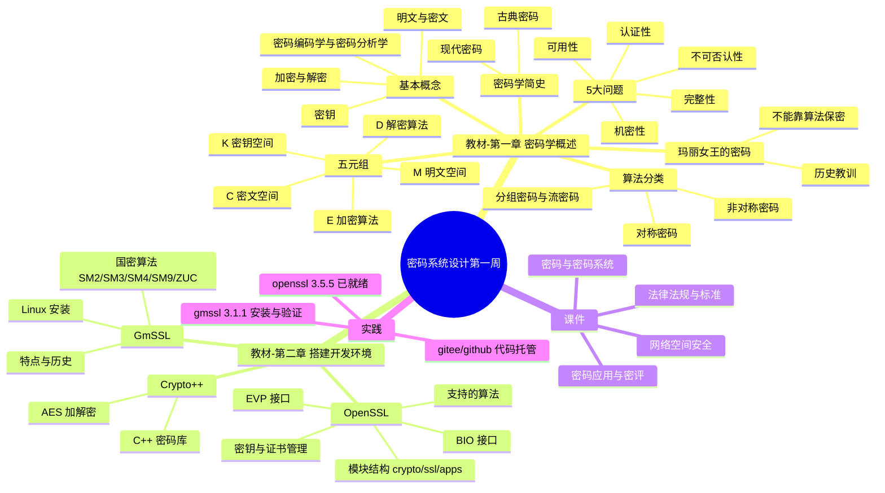

# 密码系统设计 第一周预习报告

**学号**：20241328　**姓名**：蔡贸俊

---

## 一、AI 对学习内容的总结（1分）

> 使用的 AI 工具：opencode（接入 DeepSeek API）

### 第 1 章 密码学概述

第 1 章主要讲密码学的整体面貌。开篇从历史上"玛丽女王的密码"讲起，说明密码一旦被破译可能直接决定生死，由此引出密码学的严肃性。随后梳理了密码学简史，从古代的凯撒密码等古典密码，到近代香农建立信息论、DES 与 AES 标准化、公钥密码的诞生。

1.3 节是本章核心，给出了密码学的基本概念与框架：

- **基本概念**：明文（plaintext）、密文（ciphertext）、密钥（key）、加密（encryption）、解密（decryption）、密码系统/密码体制（cryptosystem）。其中"密码学"还细分为密码编码学（cryptography）与密码分析学（cryptanalysis）。
- **密码学要解决的 5 大问题**：机密性（保密性）、完整性、认证性（真实性）、不可否认性、可用性。
- **五元组**：一个密码系统可抽象为五元组 (M, C, K, E, D)，即明文空间、密文空间、密钥空间、加密算法、解密算法。
- **加解密算法的分类**：按密钥是否相同分为对称密码（加密解密同一密钥）与非对称密码（公钥/私钥）；按处理数据方式分为分组密码与流密码。

### 第 2 章 搭建 C/C++ 密码开发环境

第 2 章讲两个重要的国际密码库 OpenSSL、Crypto++，以及国产密码库 GmSSL。

- **OpenSSL**：开源密码库，由 crypto（底层算法库）、ssl（SSL/TLS 协议实现）、apps（命令行工具）三大模块组成。它支持对称算法（AES、DES、3DES、SM4、RC4 等）、非对称算法（RSA、DSA、DH、EC）、信息摘要算法（MD5、SHA 系列、SM3），并提供密钥与证书管理功能。编程时有两套重要接口：BIO（对文件、socket 等的统一 I/O 抽象）和 EVP（高层封装，屏蔽具体算法细节）。书中还介绍了在 Windows 和 Linux 下编译安装 OpenSSL 的方法，以及 openssl 命令行工具的用法。
- **Crypto++**：纯 C++ 的密码库，书中以 AES 加解密为例演示其使用。
- **GmSSL**：国产密码库，实现了国密算法（SM2、SM3、SM4、SM9、祖冲之 ZUC 等），章节介绍了国密算法的含义、GmSSL 的特点、历史，以及在 Windows/Linux 下的编译安装方式。

---

## 二、对 AI 总结的反思与补充（2分）

### 1. AI 总结的问题

- **偏"目录复述"，缺少内在逻辑串联**：AI 的总结基本是照目录把概念罗列了一遍，但没有说明这些概念之间的因果和演进关系，例如"为什么有了对称密码还要非对称密码""为什么国密算法（SM 系列）要被强调"，这些关键问题没有被点出来。
- **对第 2 章"动手实践"的落点不够突出**：第 2 章的标题是"搭建开发环境"，重点是"装起来、跑起来"，而 AI 总结把大量篇幅放在算法分类罗列上，反而对"安装与验证"这一实操主线概括不足。
- **"5 大问题"与"五元组"表述含糊**：AI 没有把"密码学要解决的 5 大问题（安全目标）"与"密码系统五元组（形式化模型）"区分清楚，二者其实是不同层面的东西，一个回答"要什么"，一个回答"怎么描述"。
- **忽略了版本差异的重要性**：书中第 2 章多处编译的是 OpenSSL 1.0.2 / 1.1.1，而课程要求安装 3.0 以上版本，AI 总结没有提示这个版本差异（1.0.2 已停止维护，存在安全隐患）。

### 2. 自己的补充

- **关于"玛丽女王的密码"的启示**：这个历史案例的真正教训不只是"密码被破译很危险"，而是"不要把安全寄托在算法保密上"，这正是后面 Kerckhoffs 原则（柯克霍夫原则）的雏形——密码系统的安全性应建立在密钥保密之上，算法本身可以公开。这一点我认为是第 1 章埋下的一条重要主线。
- **对称与非对称的互补（混合密码体制）**：对称密码快但密钥分发困难，非对称密码解决密钥分发但速度慢，实际系统（如 TLS）是用非对称算法协商出会话密钥，再用对称算法加密数据。理解了这一点，第 2 章中 OpenSSL 同时支持对称、非对称、摘要算法才显得合理。
- **国密算法的意义**：SM2/SM3/SM4 是我国自主可控的密码算法标准，在政务、金融等关键基础设施中要求"国产化"，这是 GmSSL 这类国产密码库存在的现实背景，也是本课程（密码系统设计）要重点覆盖的内容。
- **环境搭建的两点实践体会**：
  1. 应使用 **3.0 以上的最新稳定版** OpenSSL（本机已自带 3.5.5，满足要求），1.0.2 系列已 EOL，不应再用于新开发。
  2. 用源码编译安装密码库时，**默认 `lib` 目录与硬编码 `lib64` 的差别**是常见的坑；更稳妥的做法是装到独立 prefix 并用 `PATH`/`LD_LIBRARY_PATH` 指向，而不是去覆盖系统自带的库文件。

---

## 三、学习思维导图（2分）



> 以上 Mermaid 代码可在 VSCode（Markdown 插件）或 [mermaid.live](https://mermaid.live) 中预览并截图。

---

## 四、基于 AI 的学习（2分）

> 使用苏格拉底式提问，一次一个问题，针对我理解不够好的两个概念展开。

### 概念一：对称密码与非对称密码的本质区别

**AI**：你说对称密码用同一个密钥加解密、非对称密码用一对公私钥。那么我们先从最实际的问题开始：如果只用对称密码，Alice 和 Bob 想安全通信，第一步就会卡在哪里？

**我**：他们得先让双方拿到同一把密钥，可如果一开始没有安全信道，这把密钥本身怎么传过去就成了死循环——这就是"密钥分发"难题。

**AI**：很好，你抓住了要点。那非对称密码是如何绕开这个难题的？

**我**：非对称密码有一对密钥，公钥可以公开，谁都能用它加密，但只有持有私钥的人能解。所以 Bob 只要把自己的公钥公开，Alice 用它加密发过去，无需事先共享秘密。

**AI**：既然非对称密码这么方便，为什么不干脆全用它、把对称密码淘汰掉？

**我**：因为非对称算法依赖大整数分解、离散对数这类数学难题，运算量比对称算法大好几个数量级，加密大量数据时太慢，不现实。

**AI**：那真实系统里通常怎么把两者配合起来？

**我**：用非对称算法协商/传递一个临时的对称"会话密钥"，之后的数据都用对称算法加密。这样既解决了密钥分发，又保证了速度，比如 TLS 就是这么干的。

**AI 评价**：你对对称与非对称"快但难分发 vs 慢但易分发"的互补关系理解到位，并能落到 TLS 的混合密码体制上，概念已经清楚了。

### 概念二：密码系统五元组中"密钥"独立存在的意义

**AI**：你提到密码系统可写成五元组 (M, C, K, E, D)，其中密钥 K 被单独列出来。你觉得为什么不干脆把"算法"也当成秘密藏起来，而非要单独强调"密钥"？

**我**：如果安全性靠算法保密，一旦算法泄露整个系统就崩溃；而且算法不公开就没人能审查它，可能藏着漏洞。把算法公开、只保密密钥，更安全也更可验证。

**AI**：你其实触及了一条著名原则，能说出它的名字吗？

**我**：Kerckhoffs 原则（柯克霍夫原则）：密码系统应做到即使除密钥外的一切都被公开，系统仍然是安全的。

**AI**：那顺着这个思路，为什么"密钥空间"的大小也这么关键？

**我**：密钥空间太小的话，攻击者穷举所有可能的密钥就能暴力破解，所以密钥空间必须足够大，让穷举在计算上不可行。

**AI 评价**：你从"算法公开、密钥保密"推导出 Kerckhoffs 原则，再联系到密钥空间与穷举攻击的关系，逻辑完整，理解准确。

---

## 五、学习实践过程遇到的问题与解决方式（2分）

### 问题 1：openssl 安装脚本存在严重安全缺陷（lib64 路径错误 + 覆盖系统库）

**现象**：课程给的 `opensslinstall.sh` 中，把编译好的库软链接到 `/usr/lib/x86_64-linux-gnu/`，但引用路径写成了 `${ROCHOME}/rocopenssl/lib64/libcrypto.so.3`。Ubuntu 上源码编译 OpenSSL 默认装到 `lib`，不是 `lib64`，软链接会指向不存在的文件；同时脚本还 `mv` 掉了系统自带的 `libcrypto.so.3`、`libssl.so.3` 和 `/usr/bin/openssl`，一旦替换失败会直接导致系统崩溃。

**解决过程**：审查后决定**不执行原脚本**。检查发现系统已自带 OpenSSL 3.5.5（≥3.0，比脚本要装的 3.3.2 还新），因此无需重装；同时本机缺少 `gcc/make` 无法源码编译、`sudo` 需交互密码。最终结论：OpenSSL 无需安装，保持系统原有版本即可。核心经验是——**安装密码库不要覆盖系统库，应装到独立 prefix 再用 PATH/LD_LIBRARY_PATH 指向**。

### 问题 2：GmSSL 安装后运行报 `libgmssl.so.3: cannot open shared object file`

**现象**：通过官方 `GmSSL-3.1.1-Linux.sh` 自解压安装到 `~/GmSSL-3.1.1-Linux` 后，直接运行 `bin/gmssl` 报错找不到动态库 `libgmssl.so.3`。

**解决过程**：检查发现该动态库在 `~/GmSSL-3.1.1-Linux/lib/` 下，是运行时找不到导致的。解决方法是把库路径加入 `LD_LIBRARY_PATH`：

```bash
export LD_LIBRARY_PATH="$HOME/GmSSL-3.1.1-Linux/lib:$LD_LIBRARY_PATH"
export PATH="$HOME/GmSSL-3.1.1-Linux/bin:$PATH"
```

并把这两行追加到 `~/.bashrc` 使其长期生效。重新执行 `gmssl version` 输出 `GmSSL 3.1.1`，问题解决。

### 问题 3：GmSSL 官方自解压安装器默认是交互式的

**现象**：`GmSSL-3.1.1-Linux.sh` 直接运行会进入交互式 license 确认，脚本化/自动化场景下不便。

**解决过程**：阅读安装器帮助（`--help`）发现它支持 `--prefix`、`--include-subdir`、`--skip-license` 参数，改用非交互方式安装：

```bash
sh GmSSL-3.1.1-Linux.sh --prefix=$HOME --include-subdir --skip-license
```

一次完成安装，无需人工确认。

---

## 六、参考资料

- **AI 工具**：opencode（接入 DeepSeek API）
- **图书**：《Windows C/C++加密解密实战》朱晨冰、李建英 著，清华大学出版社
- **网站**：
  - [OpenSSL 官网](https://openssl-library.org/)
  - [GmSSL 官网](https://gmssl.org/)
  - [GmSSL GitHub 发布页](https://github.com/guanzhi/GmSSL)
