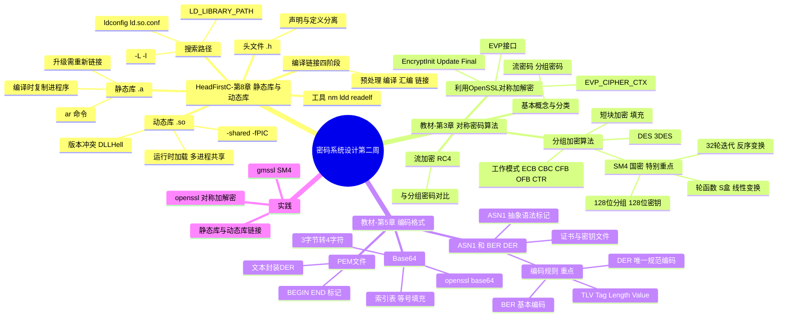
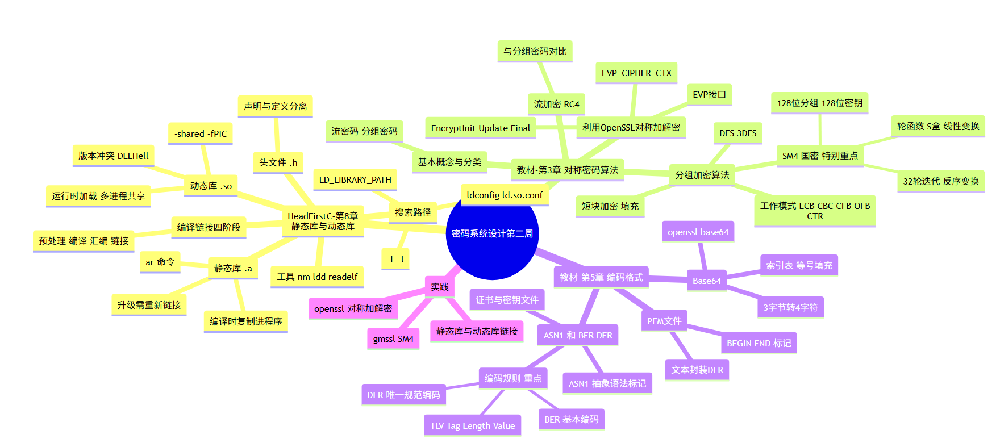

# 密码系统设计 第二周预习报告

**学号**：20241328　**姓名**：蔡贸俊

---

## 一、AI 对学习内容的总结（1分）

> 使用的 AI 工具：opencode（接入 DeepSeek API）

本周学习内容由三部分组成：**Head First C 第 8 章（静态库与动态库）**、《Windows C/C++加密解密实战》**第 3 章（对称密码算法）**与**第 5 章（密码学中常见的编码格式）**。

### Head First C 第 8 章 静态库与动态库

这一章解决的是"代码复用的组织方式"问题：当程序越来越大，不可能把所有代码塞在一个 `.c` 文件里，于是需要把可复用的代码打包成**库**，供多个程序共享。

- **编译与链接的全过程**：源代码要经历 预处理 → 编译 → 汇编 → 链接 四个阶段，最后一步"链接"负责把多个目标文件（`.o`）和库文件拼成一个可执行文件。
- **头文件（`.h`）**：只放**声明**（函数原型、结构体定义），让编译器在编译单个文件时知道"有这么个函数"；真正的**定义**放在 `.c` 里。
- **静态库（`.a`）**：用 `ar -rcs libxxx.a a.o b.o` 把目标文件打包归档。链接时，链接器把用到的库代码**整体复制进可执行文件**。优点是运行时不依赖外部库文件、部署简单；缺点是每个程序都带一份拷贝（可执行文件变大），且库升级后所有用到它的程序都要**重新链接**。
- **动态库（`.so`）**：用 `gcc -shared -fPIC` 生成。运行时才由动态链接器把库加载进内存，多个进程共享同一份。优点是省空间、库升级不必重编译程序；缺点是存在**运行时依赖**与**版本冲突**问题（即所谓的 "DLL Hell"）。
- **链接与加载时的搜索路径**：编译链接用 `-L` 指定库目录、`-l` 指定库名；运行时用 `LD_LIBRARY_PATH` 等环境变量或 `/etc/ld.so.conf` + `ldconfig` 告诉系统去哪找 `.so`。
- **辅助工具**：`nm`（查看符号表）、`ldd`（查看动态库依赖）、`readelf`（查看 ELF 结构）。

### 第 3 章 对称密码算法

本章讲"加解密用同一把密钥"的对称密码，按处理方式分为流密码与分组密码两大类。

- **3.1 基本概念、3.2 分类**：流密码逐字节/逐位处理明文，分组密码把明文切块处理。
- **3.3 流加密算法**：以 RC4 为代表，介绍了流密码与分组密码的对比。RC4 实现简单、速度快，但已发现统计偏差，不再推荐使用。
- **3.4 分组加密算法（重点）**：
  - **3.4.1 工作模式**：分组密码不能只对每一块独立加密，需要"工作模式"把块串起来——ECB（电子密码本，同一明文块产生同一密文块，会泄露明文图案，不安全）、CBC（密码分组链接，前一块密文与当前明文异或后再加密，需要初始向量 IV）、CFB、OFB、CTR（计数器模式）等。
  - **3.4.2 短块加密**：明文长度不是分组的整数倍时的**填充**问题。
  - **3.4.3 DES 与 3DES**：DES 分组 64 位、有效密钥 56 位、16 轮 Feistel 结构，密钥太短已被暴力破解；3DES 用"加密-解密-加密"（EDE）三次 DES 延长有效密钥，但效率低。
  - **3.4.4 SM4 算法（特别重点）**：我国自主的分组密码标准（GB/T 32907-2016）。分组长度 128 位、密钥长度 128 位，采用 32 轮非线性迭代加一次反序变换的结构；轮函数由异或、非线性变换 τ（S 盒替换）和线性变换 L（循环左移+异或）组成；密钥扩展用系统参数 FK 和固定参数 CK 生成 32 个轮密钥。加解密结构相同，只是轮密钥使用顺序相反。
- **3.5 利用 OpenSSL 进行对称加解密（重点）**：通过 OpenSSL 的 EVP 高层接口做对称加解密，核心是一组以 `EVP_CIPHER_CTX` 为中心的函数：`EVP_CIPHER_CTX_new`、`EVP_EncryptInit_ex`（指定算法如 `EVP_aes_256_cbc()` 和密钥/IV）、`EVP_EncryptUpdate`、`EVP_EncryptFinal_ex`（处理最后一块与填充），解密侧对应 `EVP_Decrypt*` 系列。

### 第 5 章 密码学中常见的编码格式

本章讲的是密码学数据在存储与传输中常用的**编码/封装格式**，是后续理解证书、密钥文件格式的基础。

- **5.1 Base64**：把二进制数据转换成可打印字符。核心原理是每 3 个字节（24 bit）拆成 4 组 6 bit，各查一张 64 字符的索引表得到 4 个字符；不足 3 字节时用 `=` 补齐。可用 `openssl base64` 命令编解码，也可用 OpenSSL 的 BIO/EVP 接口编程实现。
- **5.2 PEM 文件**：一种**文本形式**封装二进制 DER 数据的格式，用 `-----BEGIN XXX-----` / `-----END XXX-----` 包裹 Base64 编码的内容，例如证书、私钥文件。
- **5.3 ASN.1 和 BER、DER（重点 5.3.7）**：
  - ASN.1（抽象语法标记）是一种与实现无关的**数据结构描述语言**，用来描述"数据长什么样"。
  - **5.3.7 编码规则（重点）**：把 ASN.1 描述的数据真正编码成二进制字节，靠的是编码规则。**BER**（基本编码规则）采用 TLV 结构——`Tag`（标识数据类型）＋ `Length`（内容长度，分短型/长型两种）＋ `Value`（实际内容）；**DER**（可区分编码规则）是 BER 的**规范化子集**，对长度、字符串等给出唯一确定表示，因此适合数字签名等要求"同一数据只有一种编码"的场景（如 X.509 证书）。

---

## 二、对 AI 总结的反思与补充（2分）

### 1. AI 总结的问题

- **对"为什么第 3 章重点圈定 3.4.4 与 3.5"的动机讲得不透**：AI 把 3.4.4 当成普通一节罗列了 SM4 的参数，但没有点出课程为何"特别"强调它——SM4 是国密对称标准，和第一周 GmSSL 一脉相承，是后续"国密改造/密评"落地的算法基础；同样，3.5 之所以是重点，是因为它才是"用现成库写加密程序"的工程入口，而不仅是算法原理。
- **把"工作模式"讲得偏抽象，缺少"为什么需要它"的直观感**：AI 罗列了 ECB/CBC/CTR 等名字，但没突出最关键的结论——ECB 会泄露明文结构（两段相同明文加密后密文相同，经典"企鹅图"问题），这才是分组密码必须引入工作模式和 IV 的根本原因。
- **第 5 章的"编码格式"与全书主线的联系没说清**：AI 把 Base64/PEM/ASN.1 当成三块独立知识点介绍，但没有说明它们其实是一条链——"DER 二进制 → Base64 文本化 → PEM 封装"，理解了这条链才能理解证书文件、私钥文件为什么长成那样。
- **Head First C 第 8 章与密码开发的衔接不足**：AI 主要讲了"怎么建库"，但没有强调"静态链接 vs 动态链接"这一区别正是第一周 OpenSSL/GmSSL 安装时 `LD_LIBRARY_PATH` 报错、`lib64` 路径问题的根源，也没点出密码库几乎都以动态库方式发布、因此"运行时依赖"尤其需要关注。

### 2. 自己的补充

- **SM4 与 DES/AES 的对比视角**：SM4（128/128、32 轮、对合结构）在设计思路上与 AES（SPN 结构）不同、更接近 Feistel 族的加解密对称思想。把三者放在一起对比"分组长度、密钥长度、轮数、结构"，比孤立背 SM4 参数更有用。同时 SM4 的 S 盒是公开固定的，密钥才是秘密，再次印证第一周的 Kerckhoffs 原则。
- **工作模式的"正确打开方式"**：仅加密不足以保证数据没被篡改，所以现代实践倾向于 **AEAD 模式（如 GCM）**，把"加密"和"认证"一次做完；纯 ECB 基本只应出现在教学反例里。这是 AI 总结没展开、但对工程实践很重要的一点。
- **编码格式的现实意义**：Base64 不是加密（没有密钥，任何人可逆推），它的目的是"把二进制安全地塞进文本协议"；DER 保证唯一编码、BER 允许多种编码，二者之差直接关系到签名/证书是否可被验证。理解"编码 ≠ 加密"是避免初学者误解的关键。
- **静态库/动态库在密码场景下的取舍**：密码库（libcrypto、libssl、libgmssl）升级频繁（安全补丁），用**动态库**可以在不重编译业务程序的情况下完成补丁替换，这对安全运维很重要；而静态库会把算法代码固化进二进制，一旦发现漏洞只能重新编译发布。

---

## 三、学习思维导图（2分）





> 以上 Mermaid 代码可在 VSCode（Markdown 插件）或 [mermaid.live](https://mermaid.live) 中预览并截图。

---

## 四、基于 AI 的学习（2分）

> 使用苏格拉底式提问，一次一个问题，针对我理解不够好的两个概念展开。

### 概念一：分组密码的"工作模式"，为什么 ECB 不安全而 CBC 需要 IV

**AI**：你说分组密码只能一次加密固定长度的一块数据。那么如果用最简单的办法——把明文切成一块块、每块用同一个密钥独立加密，会出什么问题？

**我**：两段相同的明文块会得到两段相同的密文块，别人一眼就能看出明文中哪些地方是重复的，比如图片里大片的相同区域会原样暴露出来。

**AI**：没错，这就是 ECB 电子密码本模式。那要避免"相同明文产生相同密文"，最直接的想法是什么？

**我**：让每一块的加密结果都跟前面的块有关，也就是把前一块的密文先异或到当前明文上再加密，这样即使明文重复，密文也不重复。

**AI**：你说的正是 CBC 密码分组链接模式。但这里有个鸡生蛋的问题：第一块前面没有"上一块密文"，怎么办？

**我**：需要一个公开的、每次通信都不同的初始值 IV 跟第一块异或。IV 不用保密，但要随机/不可预测，否则安全性会打折扣。

**AI**：那既然 CBC 靠"异或链"消除了重复，为什么现代系统还常用 CTR 计数器模式或 GCM 模式，而不是一直用 CBC？

**我**：CBC 是串行的，上一块算完才能算下一块，没法并行；CTR 把计数器值加密后跟明文异或，可以并行、还能随机访问。而 GCM 在 CTR 加密的基础上又加了认证标签，能同时保证机密性和完整性。

**AI 评价**：你从"重复泄露"推出 CBC、从 CBC 的缺口推出 IV，再从并行与认证的角度理解 CTR/GCM，逻辑链条完整，工作模式这个概念你已经掌握了。

### 概念二：ASN.1 / BER / DER 三者到底是什么关系，为什么需要 DER

**AI**：你提到 ASN.1 是一种"描述数据结构"的语言，BER、DER 是"编码规则"。那请先想一下：为什么要先把"数据长什么样"和"怎么把它变成字节"分成两件事？

**我**：因为同一个结构可以有多种不同的二进制表示，把"抽象描述"和"具体编码"分开，换一种编码规则就能复用同一份结构定义，而不用改数据本身的定义。

**AI**：好。那 BER 编码时，接收方怎么知道一段字节从哪开始、到哪结束、表示的是什么？

**我**：BER 用 TLV 结构：先一个 Tag 标识类型，接着一个 Length 给出内容长度，最后才是 Value 内容，接收方按 Tag 和 Length 就能正确切分。

**AI**：既然 BER 已经能表示数据了，为什么还要再造一个 DER？

**我**：BER 对某些字段允许多种等价写法，比如同一个长度值可以写成长型也可以写短型。如果一份数据有多个合法编码，签名的结果就会不确定——同样内容签出来不一样，验签就可能失败。DER 就是 BER 的规范化子集，规定每种数据只有唯一一种编码，这样才能稳定地做签名和证书。

**AI**：那你能不能用一句话说清它们三者各自的角色？

**我**：ASN.1 是"画图纸"（定义结构），BER 是"一套宽松的施工方案"（允许多种合法编码），DER 是"唯一确定的那套施工方案"（保证编码唯一）。

**AI 评价**：你用"图纸 vs 施工方案"的类比，把 ASN.1 的抽象描述、BER 的宽松编码、DER 的规范唯一编码区分得很清楚，理解到位。

---

## 五、学习实践过程遇到的问题与解决方式（2分）

### 问题 1：用 OpenSSL 做 AES 加密时，ECB 模式下密文"露出了明文图案"

**现象**：用 `openssl enc -aes-128-ecb` 对一段有大量重复内容的文本加密后，发现密文的相同片段反复出现，肉眼就能看出明文的重复结构。

**解决过程**：查阅资料后明白这是 ECB 模式的固有缺陷——相同明文块产生相同密文块。改用 CBC 模式并显式指定随机 IV 后问题消失：

```bash
# ECB（不安全，仅作对比）
openssl enc -aes-128-ecb -K 0123456789abcdef0123456789abcdef -in plain.txt -out ecb.bin

# CBC（每次随机生成 IV）
openssl enc -aes-128-cbc -K 0123456789abcdef0123456789abcdef -iv 00112233445566778899aabbccddeeff -in plain.txt -out cbc.bin
```

核心经验：**分组密码必须配合正确的工作模式与 IV，ECB 只应出现在反例里**；现代实践优先选带认证的 GCM 等 AEAD 模式。

### 问题 2：链接调用 OpenSSL 的 C 程序时出现 `undefined reference`，且对静态/动态链接的差异感到困惑

**现象**：写了一个调用 `EVP_EncryptInit_ex` 的简单程序，用 `gcc a.c -lcrypto` 编译时报 `undefined reference to 'EVP_EncryptInit_ex'`；同时分不清"静态库"和"动态库"到底哪个被用到了。

**解决过程**：
1. 先解决链接顺序问题——GCC 的 `-l` 是按**从左到右**解析的，被依赖的库要放在引用它的目标文件**之后**，改成 `gcc a.c -lcrypto` 仍报错的原因是库名/顺序不对，正确写法是 `gcc a.c -o a -lcrypto`（库放在源文件后面）。用 `nm`、`ldd` 查看符号与依赖定位问题：

```bash
gcc a.c -o a -lcrypto      # 库放最后
ldd a                       # 查看运行时依赖哪些 .so
nm -D /usr/lib/x86_64-linux-gnu/libcrypto.so.3 | grep EVP_EncryptInit_ex
```

2. 弄清静态/动态区别：默认是**动态链接**（`ldd` 能看到 libcrypto.so.3）；要静态链接需 `-static`（或直接给 `.a` 路径），代价是可执行文件显著变大，且密码库一旦有漏洞无法通过换 `.so` 热修复。

核心经验：**链接顺序、静态/动态选择、运行时库搜索路径**这三件事要一起想，密码库更推荐默认动态链接以便打补丁。

### 问题 3：搞不清 PEM 文件里那段 Base64 和 ASN.1/DER 的关系

**现象**：看到证书文件开头 `-----BEGIN CERTIFICATE-----` 和中间一堆 Base64 字符，不明白它和 ASN.1、DER 编码是什么关系。

**解决过程**：用 OpenSSL 逐步"拆包"验证：
1. 用 `openssl x509 -in cert.pem -outform DER -out cert.der` 得到 DER 二进制——说明 PEM 里那堆 Base64 解码后就是 DER 编码的证书结构。
2. 用 `openssl asn1parse -in cert.der -inform DER` 逐字节查看 TLV（Tag-Length-Value）结构，直观看到每个字段的类型、长度、内容。
3. 用 `openssl base64 -d` 把 PEM 中间部分解码，确认与 DER 一致。

核心经验：**DER 是二进制编码（TLV 结构），Base64 把它文本化，PEM 再包上 BEGIN/END 标记**，这是一条"二进制 → 文本"的封装链；"编码"不等于"加密"，没有密钥保护。

---

## 六、参考资料

- **AI 工具**：opencode（接入 DeepSeek API）
- **图书**：
  - 《Windows C/C++加密解密实战》朱晨冰、李建英 著，清华大学出版社
  - 《Head First C 嗨翻 C 语言》O'Reilly / 中国电力出版社（图灵教育）
- **网站**：
  - [OpenSSL 官网](https://openssl-library.org/)
  - [GmSSL 官网](https://gmssl.org/)
  - [国家密码管理局 SM4 标准 GB/T 32907-2016](https://www.oscca.gov.cn/)
