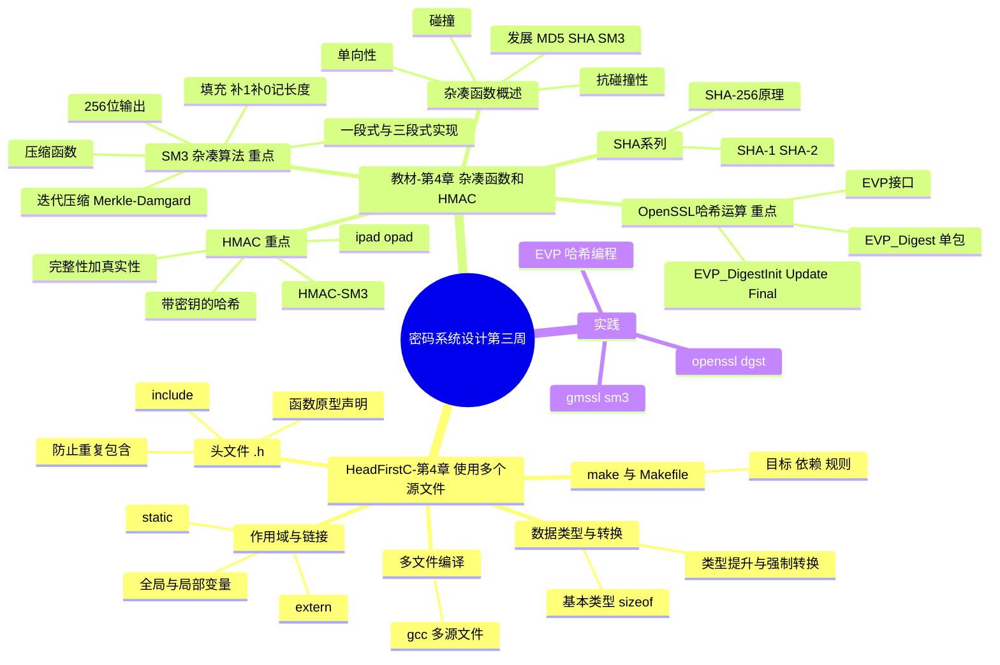
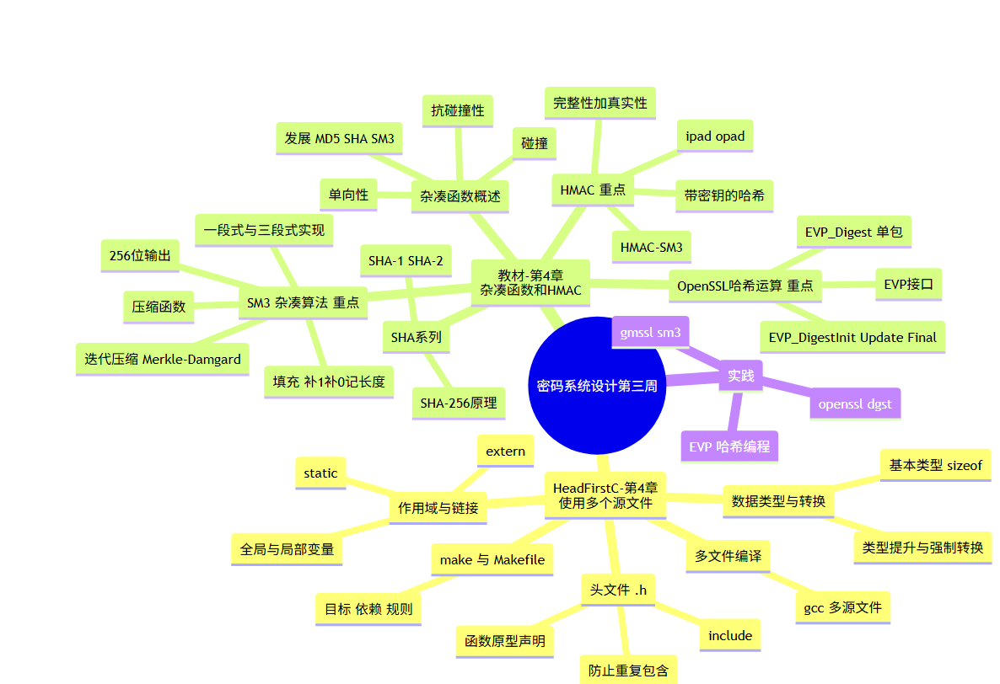

# 密码系统设计 第三周预习报告

**学号**：20241328　**姓名**：蔡贸俊

---

## 一、AI 对学习内容的总结（1分）

> 使用的 AI 工具：opencode（接入 DeepSeek API）

本周学习内容由两部分组成：**Head First C 第 4 章（使用多个源文件）**与《Windows C/C++加密解密实战》**第 4 章（杂凑函数和 HMAC）**，其中教材重点为 4.2（SM3）、4.3（HMAC）、4.5（基于 OpenSSL 的哈希运算）。

### Head First C 第 4 章 使用多个源文件

这一章解决"程序变大之后如何组织代码"的问题，是后续搭建密码库/密码程序工程的基础。

- **为什么拆文件**：单一 `main.c` 会难以维护，把相关函数拆到独立的 `.c` 源文件里，通过头文件共享声明。
- **数据类型与转换**：复习 `char/int/float/double` 等基本类型、`sizeof`、以及类型提升/强制转换等细节，避免隐式转换带来的坑。
- **头文件（`.h`）**：存放函数**原型**、结构体定义等"接口声明"，用 `#include` 引入；要防止重复包含（`#ifndef/#define/#endif` 或 `#pragma once`）。
- **多文件编译与 make**：`gcc a.c b.c -o app` 一次编译多个源文件；当文件变多、依赖变复杂时，用 `make` + `Makefile` 自动化构建（目标、依赖、规则）。
- **作用域与链接**：全局变量、局部变量、`extern`（引用其他文件的全局符号）、`static`（限制作用域为文件内部）的区别。

### 第 4 章 杂凑函数和 HMAC

本章讲密码学中的"信息摘要"：把任意长度的消息压缩成固定长度的**杂凑值（哈希值）**，用于完整性校验与消息认证。

- **4.1 杂凑函数概述**：杂凑函数是一类"单向、不可逆、把变长输入映射为定长输出"的函数，核心性质是**单向性**（由摘要推不出原文）与**抗碰撞性**（很难找到两个不同消息产生同一摘要）。发展上从 MD5、SHA-1 到 SHA-2/SHA-3、国密 SM3；碰撞即两个不同输入映射到相同输出。
- **4.2 SM3 杂凑算法（重点）**：我国自主的密码杂凑标准（GB/T 32905-2016），输出 **256 位**。采用 Merkle-Damgård 迭代结构：先**填充**（补 1、补 0、最后 64 位记原始消息长度），再按 512 位分组进行**迭代压缩**，压缩函数由常量、布尔函数、置换和异或等组合而成。书中给出了一段式与三段式两种 C 实现，并演示了用 OpenSSL 计算 SM3。
- **4.3 HMAC（重点）**：基于哈希的消息认证码（Hash-based Message Authentication Code）。普通杂凑函数**没有密钥**，任何人可重算，因此无法对抗篡改；HMAC 把密钥参与进哈希计算，用于同时验证"完整性 + 真实性"。构造上用两个固定填充 `ipad`、`opad` 分别与密钥异或后再做两次哈希，书中给出独立实现 HMAC-SM3 的过程。
- **4.4 SHA 系列**：SHA-1、SHA-2（SHA-224/256/384/512）的概述、发展史、单向性、主要用途，并重点解析了 SHA-256 的工作原理。
- **4.5 基于 OpenSSL 的哈希运算（重点）**：用 OpenSSL 的 EVP 高层接口统一做摘要。核心函数链为：`EVP_get_digestbyname`（按名字取算法，如 `EVP_sm3()`）→ `EVP_MD_CTX_create`（创建上下文）→ `EVP_DigestInit_ex`（初始化）→ `EVP_DigestUpdate`（分块喂入数据）→ `EVP_DigestFinal_ex`（结束并取出摘要）→ `EVP_MD_CTX_destroy`（销毁上下文）；另提供 `EVP_Digest` 一步完成"单包"摘要。

---

## 二、对 AI 总结的反思与补充（2分）

### 1. AI 总结的问题

- **没把"杂凑函数三性质"之间的关系讲透**：AI 罗列了单向性与抗碰撞性，但没有点出"单向性"和"抗碰撞性"其实是两个不同强度、可相互推导的目标（碰撞攻击往往比直接求原像更可行，因此抗碰撞性是更现实的安全红线），也没有解释为什么"抗第二原像/抗碰撞"比"单向"更难满足。
- **对 SM3 的"填充"意义说得偏浅**：AI 提到填充补 1 补 0 记长度，但没说明"为什么一定要把消息长度写进最后 64 位"——这是 Merkle-Damgård 结构防止**长度扩展攻击**的关键设计，也是后面理解 HMAC 为什么不能简单写成 `hash(key‖msg)` 的伏笔。
- **HMAC 用 ipad/opad 两次哈希的动机没展开**：AI 只说"把密钥参与进哈希"，没讲清楚直接 `hash(key‖msg)` 会因"密钥位置固定 + MD 结构"而遭受长度扩展攻击，也没说明 ipad/opad 是为了"把密钥展开成与分组等长、并把内外两层哈希隔离开"。
- **第 4 章与第 3 章/后续章节的承接关系缺失**：AI 没有提示"杂凑函数 + 上一周的分组密码，才能构成完整的 HMAC/认证加密"，也没有预告杂凑值是下周数字签名（第 7 章）和证书（第 5 章编码格式已在第 2 周学了）的原料，导致本章在全书链条中的位置不清晰。
- **Head First C 第 4 章的落点偏"知识复习"**：AI 把多文件、头文件、make 当语法点列了一遍，但没强调它们对密码工程的直接意义——把算法实现拆成 `.c`/`.h`、用 make 组织构建，正是"自主实现 SM3/HMAC"这类作业的标准做法。

### 2. 自己的补充

- **"摘要"不是"加密"，也不是"签名"**：哈希无密钥、不可逆，只能证明"数据没变"（完整性）；签名需要私钥（下周内容）；认证需要密钥（HMAC）。三者的职责边界一定要分清，这是初学最容易混淆的地方。
- **MD5/SHA-1 已不安全的原因与教训**：MD5、SHA-1 都被找到了实际碰撞（如 2005 年王小云团队对 MD5/SHA-1 的碰撞攻击），所以新系统应使用 SHA-256 或 SM3。这也解释了国家为什么要推 SM3 作为自主可控标准。
- **SM3 的工程细节**：SM3 输出 256 位（与 SHA-256 等长），填充规则"先补 `1` 再补若干 `0`，末 64 位为消息比特长度"；实现时"一段式/三段式"的区别在于是否把"填充→压缩"拆成多次 `Update` 调用，三段式更适合流式/大文件处理，对应 OpenSSL 的 `EVP_DigestUpdate` 多次调用模型。
- **OpenSSL 3.0 API 变化（重要实践点）**：书中 4.5 用的 `EVP_MD_CTX_create`/`EVP_MD_CTX_destroy` 是 1.x 时代的宏，**在 OpenSSL 3.0 已弃用**，应改用 `EVP_MD_CTX_new`/`EVP_MD_CTX_free`；本机 OpenSSL 3.5.5 下编译会收到 deprecated 告警，这是必须注意的版本差异。
- **Head First C 第 4 章 → 密码工程的落地**：`static` 可把内部辅助函数（如 SM3 的压缩函数）限制在单个 `.c` 内，避免符号污染；`Makefile` 能统一管理"链接 libcrypto/libssl"的编译选项，这两个技巧在后续写密码小程序时都会反复用到。

---

## 三、学习思维导图（2分）





> 以上 Mermaid 代码可在 VSCode（Markdown 插件）或 [mermaid.live](https://mermaid.live) 中预览并截图。

---

## 四、基于 AI 的学习（2分）

> 使用苏格拉底式提问，一次一个问题，针对我理解不够好的两个概念展开。

### 概念一：杂凑函数的"单向性"与"抗碰撞性"到底有什么区别

**AI**：你说杂凑函数是"单向、不可逆"的。那先想一个具体问题：如果攻击者拿到了一个 SHA-256 摘要，他想"从摘要反推原文"，这件事在计算上为什么几乎不可能？

**我**：因为哈希过程丢失了大量信息——无论输入多长，输出固定只有 256 位，中间还有大量的非线性变换，无法从输出唯一地倒推出输入，只能穷举，而穷举空间太大，不现实。

**AI**：好，这是"单向性/原像不可逆"。那"碰撞"又是什么，它跟"单向"有什么不同？

**我**：碰撞是两个**不同**的消息产生**同一个**摘要。单向性问的是"给一个输出，能不能找到对应的那个输入"；碰撞问的是"能不能随便找到两个输入，让它们的输出相同"，它不要求指定某个特定输出，所以比求原像更容易。

**AI**：既然碰撞比求原像容易，那"抗碰撞"为什么是哈希更关键的安全要求？

**我**：因为很多攻击只要制造出"两个同摘要的文件"就能得逞——比如你签了一份正常合同，攻击者再造一份内容不同但摘要相同的合同，验签时两者摘要一致，你就会被坑。所以只要碰撞被攻破，签名、证书这些依赖哈希的系统就都不可信了。

**AI**：那你能举一个历史上"抗碰撞被攻破"的真实例子吗？

**我**：MD5 和 SHA-1 都被找到了实际碰撞，比如用两个不同的文件得到同一个 MD5，导致基于 MD5 的证书/签名可以被伪造，所以现在都淘汰，改用 SHA-256 或 SM3。

**AI 评价**：你准确区分了"单向（原像困难）"和"抗碰撞（找不到两个同摘要输入）"，并联系到 MD5/SHA-1 被攻破的实例，理解到位。

### 概念二：HMAC 为什么要用 ipad/opad 两次哈希，而不是简单 hash(key‖message)

**AI**：HMAC 的核心目的是给哈希"加上密钥"。那你觉得最简单的做法是什么？

**我**：直接把密钥和消息拼在一起再哈希，比如 `H(key ‖ message)`。

**AI**：这个简单做法有什么安全隐患？提示你回想 SM3/SHA-256 的 Merkle-Damgård 结构和"消息长度写在最后 64 位"这个设计。

**我**：因为 MD 结构下，给定 `H(key‖msg)`，攻击者不需要知道密钥，就能在原始消息后面**追加**内容，算出 `H(key‖msg‖附加内容)` 的合法值，这就是长度扩展攻击。密钥拼在开头、位置固定，就等于把"没有密钥的部分"暴露给了攻击者继续延伸。

**AI**：那 ipad/opad 是怎么规避这个问题的？

**我**：它把密钥分别和两组固定值 `ipad`、`opad` 异或，先对 `ipad⊕key ‖ msg` 做一次内层哈希，再把结果拼到 `opad⊕key` 后面做一次外层哈希。这样密钥既参与了第一层也参与了最后一层，"消息"不再是可被直接延伸的部分，长度扩展攻击就失效了。

**AI**：为什么 HMAC 通常用 HMAC-SM3 或 HMAC-SHA256，而不是直接用一个"带密钥的密码学哈希"？

**我**：因为标准哈希本来就不带密钥，直接用没法认证；HMAC 是通用的、把任意哈希"升级"成消息认证码的标准构造，安全性经过证明，换底层哈希（SM3/SHA-256）都能用。

**AI 评价**：你从 `hash(key‖msg)` 的漏洞推导出长度扩展攻击，再解释 ipad/opad 双层的防堵原理，逻辑完整，说明 HMAC 的设计动机你已经真正理解了。

---

## 五、学习实践过程遇到的问题与解决方式（2分）

### 问题 1：OpenSSL 3.x 下 `EVP_MD_CTX_create` / `EVP_MD_CTX_destroy` 报弃用告警

**现象**：按教材 4.5 的代码写 SM3 摘要程序，用本机 OpenSSL 3.5.5 编译时收到一堆 `warning: 'EVP_MD_CTX_create' is deprecated`，担心照搬会埋坑。

**解决过程**：查阅 OpenSSL 3.0 迁移说明发现，`EVP_MD_CTX_create`/`EVP_MD_CTX_destroy` 是 1.x 的宏，3.0 起统一改为 `EVP_MD_CTX_new`/`EVP_MD_CTX_free`。改写后告警消失，程序输出正确摘要：

```c
EVP_MD_CTX *ctx = EVP_MD_CTX_new();              // 取代 EVP_MD_CTX_create
EVP_DigestInit_ex(ctx, EVP_sm3(), NULL);
EVP_DigestUpdate(ctx, msg, strlen(msg));
EVP_DigestFinal_ex(ctx, md, &md_len);
EVP_MD_CTX_free(ctx);                            // 取代 EVP_MD_CTX_destroy
```

核心经验：**教材的 OpenSSL 代码是 1.x 时代写的，在 3.0+ 上要按迁移表替换已弃用 API**，不能无脑照抄。

### 问题 2：用 `openssl dgst -sm3` 时不确定输出是否真的是 SM3（还是被当成了别的算法）

**现象**：运行 `openssl dgst -sm3 file.txt` 能出 64 个十六进制字符，但不确定它到底调用了 SM3，还是静默回退/报错。

**解决过程**：用两个办法交叉验证：
1. 查 OpenSSL 是否支持该摘要：`openssl list -digest-algorithms | grep -i sm3`，确认输出含 `SM3`。
2. 与 GmSSL 的结果比对，用国密库再算一遍同一个文件，两库输出一致即可确认：

```bash
openssl dgst -sm3 file.txt           # OpenSSL 算 SM3
gmssl sm3 file.txt                   # GmSSL 算 SM3，二者应一致
```

核心经验：**不同库对同一算法的结果应完全一致**，用"双库比对"能快速排除"算法选错/被回退"这类隐蔽问题。

### 问题 3：分不清"普通 SM3"和"HMAC-SM3"的差别，误以为带密钥只是"算哈希前先拼接"

**现象**：以为 HMAC-SM3 就是 `SM3(key ‖ msg)`，于是手写拼接后直接调 `EVP_Digest`，结果与 `openssl dgst -sm3 -hmac key` 的输出对不上。

**解决过程**：查到标准 HMAC 公式是 `H( (opad⊕key) ‖ H( (ipad⊕key) ‖ msg ) )`，并不是简单拼接；同时发现 OpenSSL 用 `EVP_PKEY` 系列函数（`EVP_MAC` / `EVP_DigestSign` 等）做 HMAC，而不是自己拼。最终用命令行验证正确口径：

```bash
openssl dgst -sm3 -hmac "secretkey" file.txt   # 标准 HMAC-SM3
```

核心经验：**HMAC 是"两次哈希 + ipad/opad 异或"的标准构造，绝不能简化为 hash(key‖msg)**；要复现结果必须严格按公式或直接用库提供的 HMAC 接口。

---

## 六、参考资料

- **AI 工具**：opencode（接入 DeepSeek API）
- **图书**：
  - 《Windows C/C++加密解密实战》朱晨冰、李建英 著，清华大学出版社
  - 《Head First C 嗨翻 C 语言》O'Reilly / 中国电力出版社（图灵教育）
- **网站**：
  - [OpenSSL 官网](https://openssl-library.org/)
  - [GmSSL 官网](https://gmssl.org/)
  - [国家密码管理局 SM3 标准 GB/T 32905-2016](https://www.oscca.gov.cn/)
